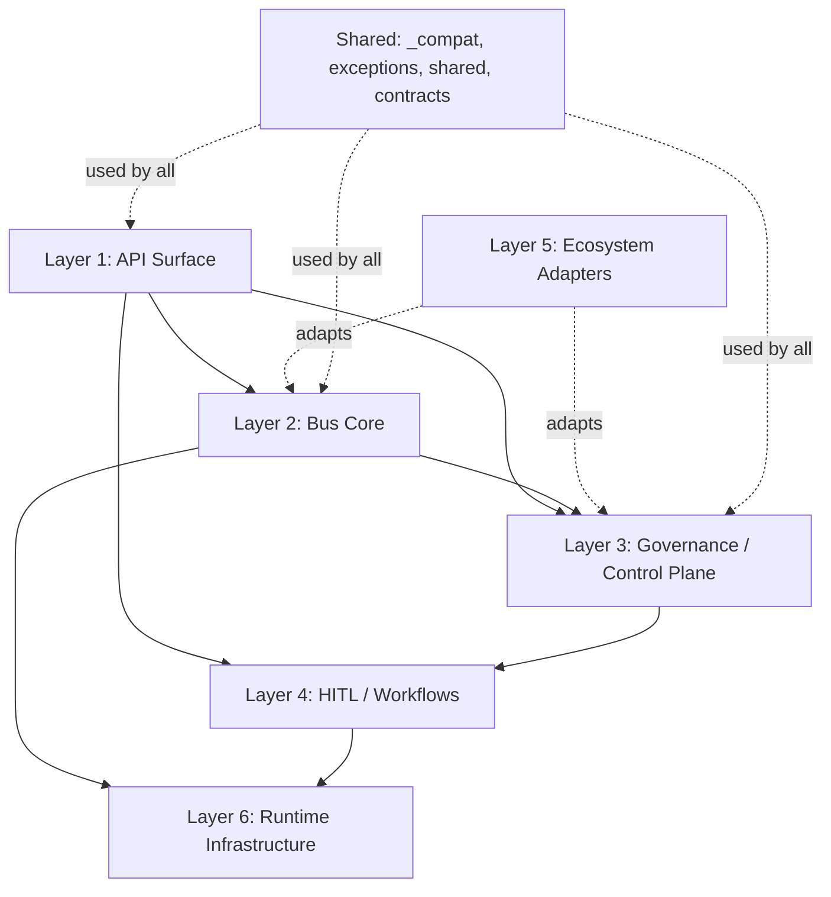

# Enhanced Agent Bus — 6-Layer Architecture

> Generated: 2026-04-15 | Validated against source tree + Codex adversarial review

## Overview

`enhanced_agent_bus` is a governed runtime platform. Its 78+ directories and 118+ top-level
modules decompose into 6 architectural layers, plus shared infrastructure and legacy namespaces.

## Layer 1: API Surface

HTTP entrypoints and route composition.

| Directory | Purpose |
|-----------|---------|
| `api/` | FastAPI app bootstrap (`app.py`) |
| `api/routes/` | Canonical route handlers (14 routers) |
| `facades/` | Lazy-loaded stable import surface (20 symbols) |
| `routes/` | **Legacy** session/tenant routes (still wired in `app.py`) |

## Layer 2: Bus Core

Message routing, dispatch, registration, and coordination.

| Directory / Module | Purpose |
|--------------------|---------|
| `bus/` | Core bus implementation |
| `agent_bus.py` | Backward-compatibility shim (72 lines, re-exports `bus.py`) |
| `message_processor.py` | 5-coordinator orchestration engine (1,443 lines) |
| `processing_strategies.py` | Message processing strategies |
| `models.py` | Shared message/agent models |
| `interfaces.py` | Core protocol definitions |
| `config.py` | Bus configuration |
| `registry.py` | Agent registry |
| `components/` | Router, registry manager, governance validator |
| `coordinators/` | MetaOrchestrator decomposition protocols |
| `pipeline/` | Message processing pipeline framework |
| `agents/` | Agent definitions (minimal) |
| `middlewares/` | Session extraction, security, batch pipeline |

## Layer 3: Governance / Control Plane

Policy decisions: constitutional, MACI, OPA, verification.

| Directory / Module | Purpose |
|--------------------|---------|
| `governance/` | Proposals, capability passports, democratic governance, Polis |
| `constitutional/` | Constitutional validation, council |
| `maci/` | MACI role enforcement |
| `opa_client/` | OPA policy client |
| `policies/` | Cedar/Rego policy storage and versioning |
| `guardrails/` | Safety guardrails |
| `verification/` | Verification layer |
| `verification_layer/` | Extended verification |
| `compliance_layer/` | Compliance checks |
| `adaptive_governance/` | Adaptive governance |
| `acl_adapters/` | ACL enforcement via OPA/Z3 |
| `contracts/` | Agent behavioral contracts |
| `sdpc/` | SDPC deliberation engine (AMPO, ASC, PACAR) |
| `validators/` | MACI + governance validators |
| `pqc_validators.py` | Post-quantum cryptography enforcement |

## Layer 4: HITL / Workflows

Human-in-the-loop, durable execution, approval workflows.

| Directory / Module | Purpose |
|--------------------|---------|
| `deliberation_layer/` | Voting, queues, consensus, multi-approver |
| `persistence/` | Durable workflow execution, repositories |
| `saga_persistence/` | Saga-pattern persistence |
| `workflows/` | Workflow definitions |
| `ai_assistant/` | Dialog management with governance integration |
| `collaboration/` | Real-time multi-user editing |
| `feedback_handler/` | Feedback collection and persistence |
| `response_quality/` | Response validation and refinement |
| `swarm_intelligence/` | Multi-agent coordination, Byzantine consensus |

## Layer 5: Ecosystem Adapters

External protocols, LLM providers, orchestration frameworks.

| Directory / Module | Purpose |
|--------------------|---------|
| `llm_adapters/` | Model-agnostic LLM framework |
| `adapters/` | LLM provider implementations (Anthropic, OpenAI, etc.) |
| `mcp/`, `mcp_server/`, `mcp_integration/` | MCP protocol |
| `langgraph_orchestration/` | LangGraph integration |
| `enterprise_sso/` | Enterprise SSO |
| `federation/` | Federation protocol |
| `integrations/` | External service integrations |
| `meta_orchestrator/` | Meta-orchestration |
| `policy_copilot/` | Policy copilot assistant |
| `visual_studio/` | VS Code integration |
| `cognitive/` | GraphRAG, long-context inference |
| `data_flywheel/` | Continuous learning pipeline |
| `ab_testing_infra/` | A/B testing |
| `optimization_toolkit/` | LLM cost/performance optimization |
| `snapshot/` | Ethereum DAO governance bridge |
| `tools/` | Browser automation and web tools |
| `bundle_registry.py` | OCI bundle registry client |

## Layer 6: Runtime Infrastructure

Observability, security, resilience, memory, health.

| Directory / Module | Purpose |
|--------------------|---------|
| `observability/` | Structured logging, metrics |
| `security/` | Security scanning, event tracking |
| `circuit_breaker/` | Circuit breaker patterns |
| `context_memory/` | Mamba-2 hybrid processor, LTM, context optimization |
| `agent_health/` | Agent health monitoring |
| `multi_tenancy/` | Tenant isolation |
| `chaos/` | Chaos testing |
| `monitoring/` | Runtime monitoring |
| `rust/` | Rust acceleration (optional) |
| `batch_processor_infra/` | Batch processing infrastructure |
| `online_learning_infra/` | Online learning infrastructure |
| `impact_scorer_infra/` | Impact scoring infrastructure |
| `profiling/` | Performance profiling |
| `runtime/` | Runtime components |
| `ifc/` | Information Flow Control (taint tracking) |
| `prov/` | W3C PROV provenance labels |
| `data/` | Reference baseline datasets for drift detection |

## Shared / Cross-Cutting

| Directory | Purpose |
|-----------|---------|
| `_compat/` | Backward-compatible shims for monorepo/standalone install (19 files) |
| `exceptions/` | Exception hierarchy used across all layers |
| `shared/` | Fail-closed helpers and utilities |
| `contracts/` | Agent behavioral contracts (also touches governance) |

## Bridge Packages

These intentionally cross layer boundaries by design:

- **`facades/`** — lazy-loads symbols from message processing, validators, bundle registry, tenancy ORM, and agents
- **`pipeline/`** — composes core models with middleware
- **`routes/`** — mixes route re-exports with middleware conveniences (legacy, being retired)

## Legacy Namespaces

| Directory | Status | Replacement |
|-----------|--------|-------------|
| `context/` | Deprecated (marked in `__init__.py`) | `context_memory/` |
| `policy/` | Legacy verification script | `_compat/policy/`, `policies/` |
| `routes/` | Superseded by `api/routes/` | Still wired in `app.py` |

## Extension Modules (`_ext_*.py`)

15 re-exported extensions (379 total symbols) organized by layer:

- **Bus core**: circuit_breaker, circuit_breaker_clients
- **Governance**: chaos, decision_store, explanation_service, pqc
- **Runtime infra**: cache_warming, context_memory, context_optimization, performance, persistence, response_quality
- **Ecosystem**: cognitive, langgraph, mcp

3 experimental extensions (NOT re-exported): `_ext_browser_tool`, `_ext_cognee`, `_ext_spacetimedb`

## Cross-Layer Violation Density

4 violations across 78 dirs + 118 modules (0.02%):

| From | To | Import |
|------|----|--------|
| `constitutional/council.py` | `deliberation_layer.voting_service` | Governance -> HITL |
| `deliberation_layer/impact_scorer.py` | `llm_adapters.config` | HITL -> Ecosystem |

Both are expected: governance feeds deliberation workflows, HITL needs LLM adapters for reasoning.

## Related Documents

- [GOVERNANCE_DELIBERATION_EXTRACTION_PLAN.md](GOVERNANCE_DELIBERATION_EXTRACTION_PLAN.md) — phased extraction of governance and deliberation into separate packages
- [MESSAGE_PROCESSOR_ARCHITECTURE.md](MESSAGE_PROCESSOR_ARCHITECTURE.md) — 5-coordinator pattern deep dive
