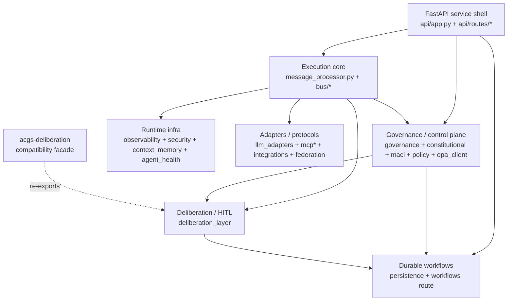
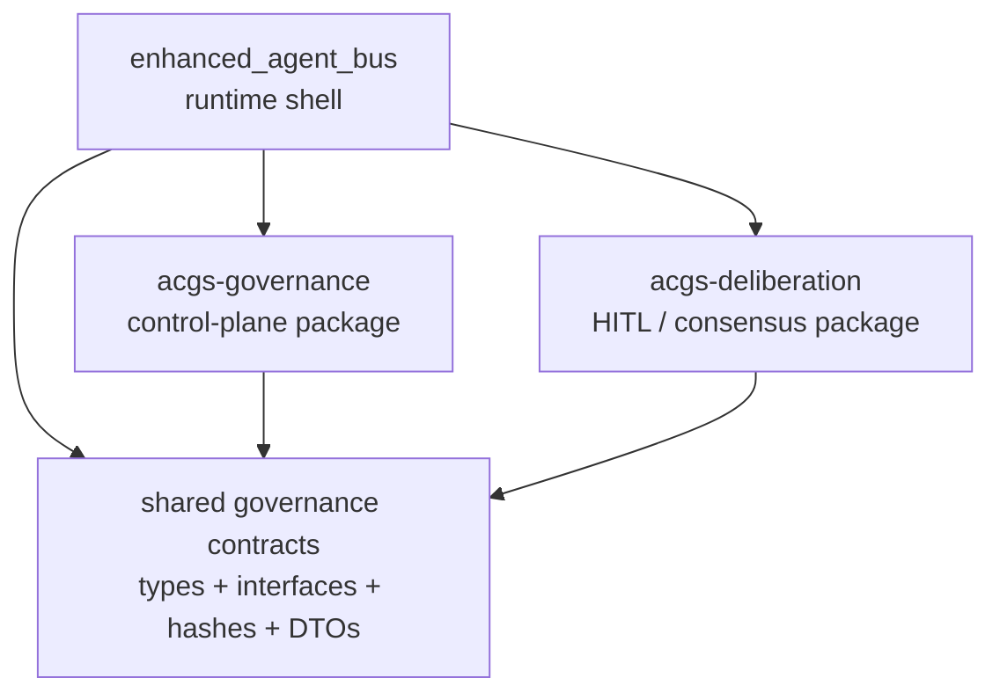
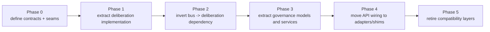

# Governance and Deliberation Extraction Plan

> Updated: 2026-04-15
> Scope: `packages/enhanced_agent_bus/`, `packages/acgs-deliberation/`

## Purpose

This document defines a migration plan for extracting governance and deliberation out of
`enhanced_agent_bus` without breaking the current FastAPI service, fail-closed behavior, or
compatibility surfaces already consumed by downstream packages.

The plan is grounded in:
- package manifests
- exported APIs
- FastAPI bootstrap and route layout
- top-level module layout
- package-local architecture docs

It is not a full behavioral audit of every runtime path.

## Current State

`enhanced_agent_bus` is a governed runtime platform, not just a message bus. Governance and
deliberation are embedded inside the service shell and execution core, alongside runtime
infrastructure, adapters, and workflows.

### Current-state placement

### Observed subsystem boundaries

- The **service shell** is composed in `api/app.py` and `api/routes/*`.
- The **execution core** is centered on `message_processor.py` and the modular `bus/` package.
- The **governance/control plane** spans `governance/`, `constitutional/`, `maci/`,
  `policy*`, `opa_client/`, and governance-facing API routes.
- The **deliberation plane** is concentrated in `deliberation_layer/`.
- The **durable execution plane** lives in `persistence/` and the workflow admin routes.
- `acgs-deliberation` already exists as a **compatibility seam**, but still re-exports the bus
  implementation rather than owning it.

## Extraction Goal

Move governance and deliberation into clearer package boundaries while keeping
`enhanced_agent_bus` as the runtime shell that hosts:

- HTTP/API composition
- message ingress and routing
- tenancy, auth, and middleware
- runtime observability and security
- workflow persistence and orchestration
- adapter ecosystems

The extraction should make `enhanced_agent_bus` consume governance and deliberation as
dependencies, instead of implementing both internally.

## Target State

The target state is a runtime shell with two extracted domain packages and one shared contracts
layer.

### Target-state package model

### Target responsibilities

#### `enhanced_agent_bus` keeps

- `api/`, `api/routes/`, auth, tenant boundaries, middleware
- `message_processor.py`, `bus/`, registry, transport, routing
- `persistence/`, `saga_persistence/`, workflow executor, workflow repository adapters
- `observability/`, `security/`, `context_memory/`, `agent_health/`
- `llm_adapters/`, `mcp*`, `integrations/`, `federation/`

#### `acgs-governance` owns

- governance proposal lifecycle
- stakeholder and deliberation-domain models tied to constitutional change control
- capability passports and domain autonomy policies
- constitutional amendment workflows
- MACI role models and enforcement logic that are domain-pure
- policy-evaluation abstractions and governance decision interfaces

#### `acgs-deliberation` owns

- `VotingService`, `Election`, `Vote`, `VoteSession`, `VoteEvent`
- `DeliberationQueue`, `DeliberationTask`
- Redis-backed vote collection and queueing
- `multi_approver`
- GraphRAG enrichment for deliberation context
- impact scoring APIs and provider hooks

#### Shared contracts layer owns

- constitutional hash and validation DTOs used across package boundaries
- governance decision / receipt / error interfaces
- deliberation and workflow handoff DTOs
- stable service interfaces consumed by the bus and routes

This contracts layer can begin as an internal namespace inside `enhanced_agent_bus/contracts/`
and later become a standalone package only if cross-package reuse justifies it.

## Why Deliberation Should Extract Before Governance

Deliberation already has the cleanest seam:

- it is concentrated under `deliberation_layer/`
- it already has a dedicated compatibility package: `acgs-deliberation`
- its public surface is cohesive and well named
- it is less entangled with HTTP composition than governance routes are

Governance is broader and more coupled to:

- route wiring
- policy enforcement
- MACI APIs
- workflow persistence
- runtime auth and tenant semantics

That makes deliberation the lower-risk first move.

## Proposed Migration Sequence

## Detailed Plan

### Phase 0: Stabilize contracts and ownership

Goal: make implicit coupling explicit before code moves.

Actions:
- define stable interfaces for governance decisions, deliberation submissions, and workflow
  handoff records
- identify which models are package-private versus boundary-safe
- move cross-cutting DTOs toward `contracts/` or a similar neutral namespace
- stop new direct imports from routes/core into low-level governance and deliberation internals

Exit criteria:
- routes depend on service interfaces or package entrypoints, not scattered internals
- current public imports are documented
- no new cross-domain imports are introduced during extraction work

### Phase 1: Extract deliberation implementation into `acgs-deliberation`

Goal: make the existing compatibility package own real code instead of re-exporting the bus.

Actions:
- move `deliberation_layer/*` implementation into `packages/acgs-deliberation`
- keep the public symbols stable
- move optional ML-backed impact scoring behind the same lazy-load pattern
- make bus-side imports depend on `acgs_deliberation`, not local `deliberation_layer`
- retain bus-local compatibility re-exports during the transition

Keep in `enhanced_agent_bus`:
- workflow executor and repositories
- route wiring
- tenant/auth enforcement around deliberation-triggered endpoints

Key constraint:
- `acgs-deliberation` must not take a hard dependency on the full bus runtime just to provide
  voting and queue semantics

Exit criteria:
- `acgs-deliberation` contains the implementation, tests, and public API
- `enhanced_agent_bus.deliberation_layer` becomes a compatibility facade
- no runtime code outside compatibility shims imports deliberation internals from the bus

### Phase 2: Normalize bus-to-deliberation integration

Goal: make deliberation a clean downstream dependency of the bus runtime.

Actions:
- inject deliberation services into `MessageProcessor` or its coordinators through interfaces
- keep workflow and audit sinks on the bus side
- define explicit adapters for:
  - impact score -> approval threshold
  - queue/task submission
  - vote-session persistence and lookup

Exit criteria:
- bus core references deliberation through interfaces or package entrypoints
- bus routes remain unchanged externally
- deliberation package no longer requires bus internals for basic operation

### Phase 3: Extract governance domain models and services into `acgs-governance`

Goal: separate control-plane logic from runtime shell logic.

First extraction targets:
- `governance/`
- domain-pure parts of `constitutional/`
- domain-pure parts of `maci/`
- governance proposal models and orchestrators
- capability passport types and registries

Do not extract immediately:
- route-level auth/tenant enforcement
- runtime-specific OPA wiring that is still tightly coupled to the service shell
- workflow repository implementations

Key rule:
- extract **domain logic first**, adapters later

Exit criteria:
- governance models and services live outside the bus package
- bus imports governance entrypoints instead of local subpackages
- routes still preserve current HTTP behavior

### Phase 4: Move governance and deliberation HTTP composition behind adapters

Goal: keep `enhanced_agent_bus` as the host application while reducing package-internal imports.

Actions:
- refactor `api/routes/governance.py` and related routes to call injected service objects
- keep tenant/auth/rate-limit logic local to the bus runtime
- avoid importing deep governance module paths directly in routes
- isolate PQC enforcement, tenant scoping, and auth boundary logic as runtime adapters

Exit criteria:
- routes depend on narrow application services
- extracted packages remain framework-agnostic
- API stability is preserved

### Phase 5: Retire shims and finalize package boundaries

Goal: reduce compatibility debt after downstream consumers move.

Actions:
- deprecate and later remove bus-local re-exports for extracted modules
- shrink the root `enhanced_agent_bus.__init__` surface where practical
- keep only documented compatibility aliases with removal dates
- update README and package docs to reflect the new ownership model

Exit criteria:
- extracted packages own their code
- the bus runtime shell is smaller and clearer
- compatibility shims are documented and bounded

## Module Mapping

| Current area | Target owner | Notes |
| --- | --- | --- |
| `deliberation_layer/` | `acgs-deliberation` | Best first extraction target |
| `governance/` | `acgs-governance` | Domain models/services first |
| `constitutional/` | split | Pure governance logic out first; runtime-coupled parts later |
| `maci/` | split | Domain types/enforcement out first; route adapters stay in bus |
| `api/routes/governance.py` | `enhanced_agent_bus` | Keep as runtime adapter layer |
| `persistence/` | `enhanced_agent_bus` | Remains runtime infrastructure |
| `message_processor.py` | `enhanced_agent_bus` | Consumes extracted services, does not move |
| `opa_client/` | staged | Keep local until policy interface stabilizes |

## Architectural Invariants

These must remain true throughout the migration:

- governance and policy decisions stay fail-closed
- existing HTTP endpoints do not change shape without an explicit versioning decision
- tenant/auth enforcement remains in the runtime shell
- workflow persistence stays runtime-owned
- extracted packages do not gain accidental dependencies on the full bus service
- compatibility aliases are additive first, then deprecated, then removed

## Risks

### 1. Hidden model coupling

Risk:
- governance and deliberation code may depend on bus-local models, utilities, or runtime state in
  ways not obvious from package entrypoints

Mitigation:
- introduce contracts first
- move models and interfaces before moving logic

### 2. Route-to-domain leakage

Risk:
- FastAPI route modules currently mix auth, tenancy, and domain behavior

Mitigation:
- keep routes in the bus package
- extract only framework-agnostic services

### 3. Workflow entanglement

Risk:
- governance and deliberation may implicitly rely on workflow persistence semantics

Mitigation:
- treat workflows as runtime infrastructure
- pass workflow operations through explicit ports/adapters

### 4. Compatibility sprawl

Risk:
- multiple layers of re-export and aliasing can leave the architecture more confusing than before

Mitigation:
- keep a single documented compatibility entrypoint per extracted area
- time-box shim removal

## Verification Checklist

Before each migration phase is considered complete:

- current imports are mapped and boundary-safe
- public package entrypoints remain stable
- affected route tests still pass
- extracted package tests pass directly
- compatibility re-export tests pass
- fail-closed behavior remains verified for governance and policy paths
- no new cross-domain imports were introduced

## Recommended First Deliverables

1. Convert `acgs-deliberation` from re-export package to implementation-owning package.
2. Add a governance contracts module for shared DTOs/interfaces.
3. Refactor route and core imports to use those package entrypoints instead of deep local imports.

This sequence delivers the cleanest architectural gain with the lowest migration risk.
